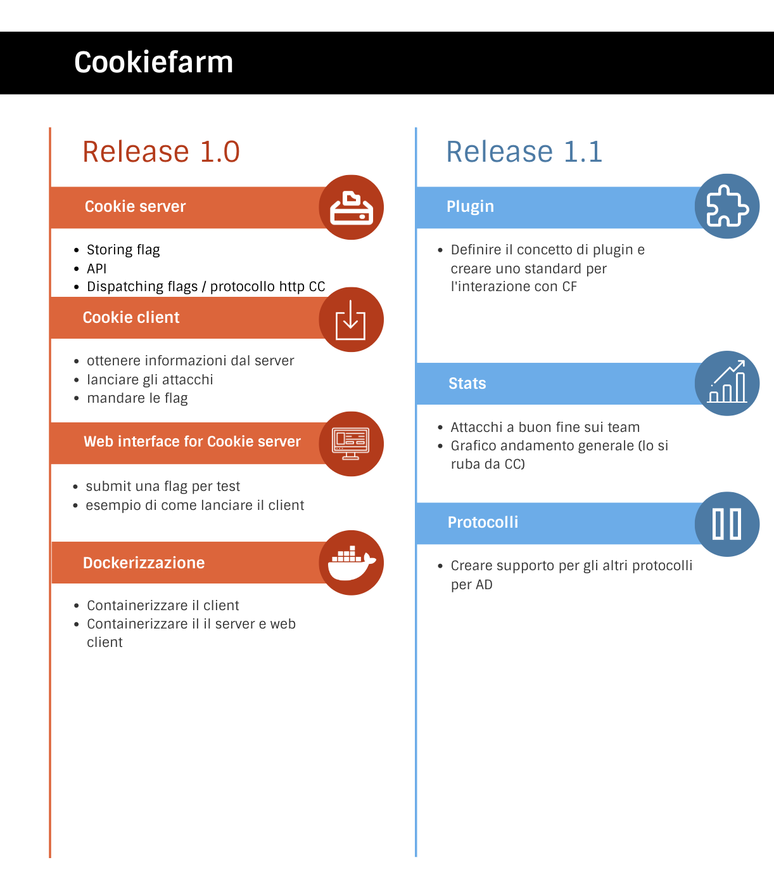
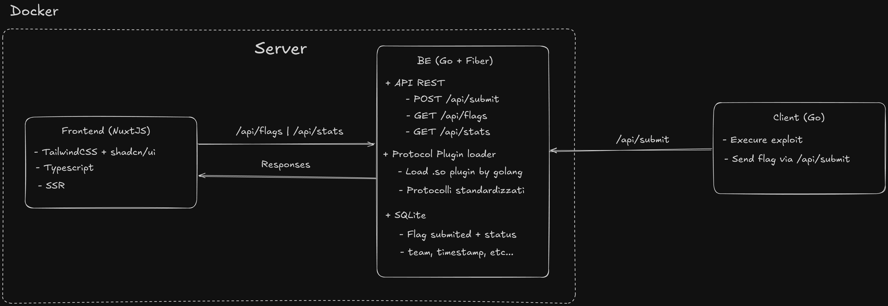

# CookieFarm

## Roadmap

## Schema

# Versions

- Bun: 1.2.9
- Go: 1.24.2
- Docker: 28.0.4

# Go code quality

- Grade .......... A+ 100.0%
- Files ................. 28
- Issues ................. 0
- gofmt ............... 100%
- go_vet .............. 100%
- gocyclo ............. 100%
- ineffassign ......... 100%
- license ............. 100%
- misspell ............ 100%

# NOTE

- release 1.1 è fixing
- release 1.2 è feature delle stat e view
- release 1.3 è feature della cli

# IDEE

## RELEASE 1.0
- [x] Setup project
  - [x] Setup client go project (makefile,logging) - @akiidjk
  - [x] Setup server go project (fiber,air,makefile,logging) - @akiidjk
  - [x] Setup frontend nuxt project (with shadcnui, tailwindcss, typescript, eslint, alias path) - @suga
  - [x] Docker base config - @akiidjk
- [x] Setup repository
  - [x] Setup .gitignore - @akiidjk @suga
  - [x] Setup security settings of repository (branch protection, code scanning, pull request review, code review, pull request approval) - @suga
- [x] Configurazione da file/shitcurl (json parsato)
- [x] Numero configurabile di thread nelle coroutine
- [x] Upgrade FE
- [x] Aggiungere Docs (Codice e user)
- [x] Rifare log e cli di server e client
- [x] Ottimizzazione exploiter per gestire servizi di macchine down etc...
- [x] Fare il README.md
- [x] Aggiungere un bottone sulla table per aggiornarla senza ricaricare la pagina

## RELEASE 1.1.0
- [x] Auto Reload @akiidjk
- [x] api/button to delete/remove the flag queue @akiidjk
- [x] api/button to send flags, instead of waiting the timer @akiidjk
- [x] Config Reloader (hot reload of config file || button to reload) @akiidjk
- [x] Permettere all'utente di stampare la flag (e la merda che vuole) in stdout senza dover restituire obbligatoriamente la flag (by Matte) @Matte
- [x] Non fare la batch per la stampa delle flag ma alla conclusione di ogni exploit stampare le flag prese direttamente senza aspettare l'attesa degi altri exploit !!!! PRIORITY
- [X] Implementazione websocket da client a server !!!! PRIORITY
- [x] Inserire la porta non nell'exploit ma come argomento dell'exploiter
- [x] Fornire il numero del team e il nome del servizio nella funzione
- [x] Creazione della libraria exploiter da poter utilizzare tramite `pip`
- [x] Comandi all'interno del client per generare il template, runnare gli exploit, ecc
- [x] Installazione del client tramite `install.sh` per averlo globale

## RELEASE 1.2.0

- [x] Implement flagsId @suga
- [x] TTL per le flag
- [x] Install cookieclient (binary) with pip @suga
- [x] Exploit test
- [x] Update data structure:
  - [x] Rename Flag struct to ClientData
  - [x] Add username, exploit name
  - [x] Addare nella config del server: ticktime, ad_start
- [x] Client update:
  - [x] Handle the stats that client sends to the server @akiidjk
  - [x] Add the Test command to the client (run the exploit only for the NOP team) @akiidjk
    - [x] Add in the Server Config (`config.yml`) the id of the NOP team @akiidjk
    - [x] Replace in the Server Config (`config.yml`) the 'my ip' with the id of the team NOT the ip address @akiidjk
- [x] Comando da client per inviare le flag al checker @akiidjk
- [x] Completed cli (create template, RealTime consumo di risorse di tutti i client e boh altre info, flag che sono state inviate al server)
- [x] Compatibilità windows @akiidjk
- [x] Better handling of Local and Shared config (Singleton architecture for race condition, better handling of config file, etc)
- [x] Migrazione da htmx a Next.js @akiidjk
- [x] new Branch handling
- [x] Filtri
   Filtri componibili fatti da SQL
   - [x] Filtri per servizi
   - [x] Filtri per team
   - [x] Fitri per Status
   - [x] Filtri per tempo (last 30m, last 1h, ...)
- [x] Search message
   - [x] Search WHERE msg LIKE '%?%'
- [x] Sort @suga
    - [x] Sort by team
    - [x] Sort by response_time
    - [x] Sort by submit_time

## RELEASE 2.0 (Cyberchallenge update)
- [x] Design con shadcnui @suga @akiidjk
  - [x] Login page
  - [x] Login system with middleware etc... @akiidjk
  - [ ] Remake all endpoints for the new design with tables @akiidjk
  - [ ] All configuration related to the new design
  - [ ] Implement autoreload
  - [ ] Implement real-time updates (idk)
  - [ ] Implement search
  - [ ] Implement filters
  - [ ] Implement sorting
  - [ ] Implement pagination
  - [ ] Implement stats
  - [ ] Implement team management
  - [ ] Implement flag management (submit, remove)
  - [ ] Implement `enter the flag` input
  - [ ] Table with all the flags
  - [ ] Tutorial nella dashboard
- [ ] Extreame update and improvements to Server side part
- [ ] Improvements docs for monitoring
- [ ] Non mettere 5 threads di default ma mettere un numero adeguato in base al numero di team presi della config e mettere un upper-limit @suga
- [ ] Calcolatore della SLA
- [ ] Simulatore dell'andamento della gara (active learning)
- [ ] Auto Flag
- [ ] Aggiungere un display che misura ram e cpu del processo (cli - client, web - server)
- [ ] Exploit Manager che runna più di un exploit (by Matte)
- [ ] Aggiungere numero client attacanti realtime displayato sulla dashboard,
- [ ] Compatibilità macos @Dabi

## RELEASE BOH SI QUANDO ABBIAMO TEMPO
- [ ] Sostituire le richieste in GO con `requests.h`

## Final test

- Test con infra reale
- Team separato
- Exploit dai writeup
